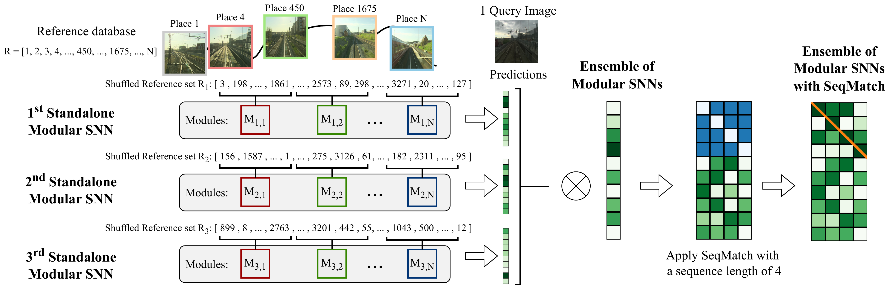
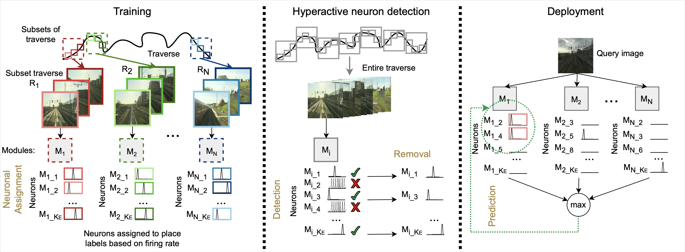
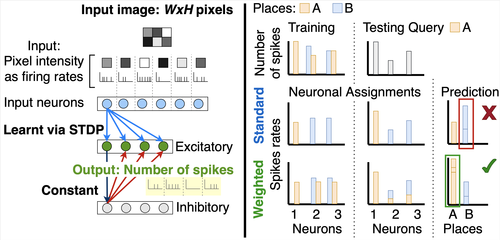

# Spiking Neural Networks for Visual Place Recognition via Weighted Neuronal Assignments
[](https://creativecommons.org/licenses/by-nc-sa/4.0/)
[](https://github.com/QVPR/VPRSNN/stargazers)

[](https://qcr.ai)


This repository contains code for three of our papers: 

* Ensembles of Modular SNNs with/without sequence matching: [Applications of Spiking Neural Networks in Visual Place Recognition](https://arxiv.org/abs/2311.13186)

* Modular SNN: [Ensembles of Compact, Region-specific & Regularized Spiking Neural Networks for Scalable Place Recognition (ICRA 2023)](https://arxiv.org/abs/2209.08723) DOI: [10.1109/ICRA48891.2023.10160749](https://doi.org/10.1109/ICRA48891.2023.10160749)

* Non-modular SNN: [Spiking Neural Networks for Visual Place Recognition via Weighted Neuronal Assignments (RAL + ICRA2022)](https://arxiv.org/abs/2109.06452) DOI: [10.1109/LRA.2022.3149030](https://doi.org/10.1109/LRA.2022.3149030)


## Updates
Dec 2023: 

* Integration of ensembling and sequence matching for Modular SNN.
* Option to shuffle the input images.
* Addition of dataset configuration for Nordland, Oxford RobotCar, SFU Mountain, Synthia and St Lucia. 

Oct 2023:

* Release of learned weights of the Modular SNN on Nordland using reference traverses spring and fall.

May 2023: 

* Incorporating modularity for the SNN architecture.
* Improved code readability. 
* Reduced computation for loading datasets. 


## License and Citations

This code is licensed under [MIT License](./LICENSE). 

If you use our Ensemble of Modular SNNs with/without sequence matching code, please cite the following [paper](https://arxiv.org/abs/2311.13186):

```
@article{hussaini2023applications,
  title={Applications of Spiking Neural Networks in Visual Place Recognition},
  author={Hussaini, Somayeh and Milford, Michael and Fischer, Tobias},
  journal={arXiv preprint arXiv:2311.13186},
  year={2023}
}
```

If you use our Modular SNN code, please cite the following [paper](https://arxiv.org/abs/2209.08723):

```
@inproceedings{hussaini2023ensembles,
  title={Ensembles of compact, region-specific \& regularized spiking neural networks for scalable place recognition},
  author={Hussaini, Somayeh and Milford, Michael and Fischer, Tobias},
  booktitle={2023 IEEE International Conference on Robotics and Automation (ICRA)},
  pages={4200--4207},
  year={2023},
  organization={IEEE}
}
```

If you use our Non-modular SNN code, please cite the following [paper](https://arxiv.org/abs/2109.06452):


```
@article{hussaini2022spiking,
  title={Spiking Neural Networks for Visual Place Recognition via Weighted Neuronal Assignments},
  author={Hussaini, Somayeh and Milford, Michael J and Fischer, Tobias},
  journal={IEEE Robotics and Automation Letters},
  year={2022},
  publisher={IEEE}
}
```


## Overview
Please refer to the readme files of the [Ensemble of Modular SNNs & sequence matching](https://github.com/QVPR/VPRSNN/blob/main/ens_seq/README.md), [Modular SNN](https://github.com/QVPR/VPRSNN/blob/main/modular_snn/README.md) and [Non-modular SNN](https://github.com/QVPR/VPRSNN/blob/main/non_modular_snn/README.md) folders for instructions to run the code for each work respectively. 


## Applications of Spiking Neural Networks in Visual Place Recognition (Ensemble of Modular SNNs with/without sequence matching)

<p style="width: 50%; display: block; margin-left: auto; margin-right: auto">
  
</p>

## Modular SNNs for scalable place recognition (Modular SNN)

Video: https://www.youtube.com/watch?v=TNDdfmPSe1U&t=137s

<p style="width: 50%; display: block; margin-left: auto; margin-right: auto">
  
</p>


## SNNs for VPR (Non-modular SNN)

Video: https://www.youtube.com/watch?v=VGfv4ZVOMkw

<p style="width: 50%; display: block; margin-left: auto; margin-right: auto">
  
</p>


This work is an adaptation of the spiking neural network model from "Unsupervised Learning of Digit Recognition Using Spike-Timing-Dependent Plasticity", Diehl and Cook, (2015) for Visual Place Recognition (VPR). DOI: [10.3389/fncom.2015.00099](https://doi.org/10.3389/fncom.2015.00099).
Visual Place Recognition is the problem of how a robot can identify whether it has previously visited a place given an image of the place despite challenges including changes in appearance and perceptual aliasing (where two different places look similar). 

The code is based on the following repositories, that include the original code and the modified versions of the original code. 

Original code (Peter U. Diehl): https://github.com/peter-u-diehl/stdp-mnist

Updated for Brian2: zxzhijia: https://github.com/zxzhijia/Brian2STDPMNIST

Updated for Python3: sdpenguin: https://github.com/sdpenguin/Brian2STDPMNIST


Please refer to the [wiki tab](https://github.com/QVPR/VPRSNN/wiki) for additional ablation studies. 


## Acknowledgements
These works were supported by the Australian Government, Intel Labs, and the Queensland University of Technology (QUT) through the Centre for Robotics.


